# How AI Systems Work

*A gentle introduction to the machines that chat, code, and create.*

---

You've probably used ChatGPT, Claude, or Gemini. You type something, and a few seconds later, a response appears — sometimes helpful, sometimes creative, occasionally wrong, but usually coherent. It feels like talking to a person.

It's not a person. It's a machine — a very clever one, but a machine nonetheless. This document explains what's actually happening when you use one of these systems.

### A Note on Scope

"AI system" is a broad term. It includes Google Search ranking pages by relevance, Netflix recommending what to watch next, your phone sorting photos by who's in them, and self-driving cars navigating streets. All of these are AI systems — but they work on different principles.

This document focuses on one specific kind: conversational AI assistants powered by large language models. These are the systems that have entered public consciousness in the last few years — ChatGPT, Claude, Gemini, and their relatives. They're the ones you chat with, that write code, answer questions, and generate text. They all share a common architecture, and that's what we'll explore.

Google Search, recommendation algorithms, computer vision, and other kinds of AI fall outside our scope here. They're important — just not what this document is about.

With that cleared up, let's begin. We'll start from the ground up, assuming nothing. By the end, you'll understand the architecture that powers every modern AI assistant.

---

## What Happens When You Type a Message

Let's start with the simplest possible example. You open ChatGPT and type:

> *"What is the capital of France?"*

A few seconds later, it replies:

> *"The capital of France is Paris."*

What just happened? At the highest level — the level you experience as a user — two things:

1. You typed a message.
2. You got a response back.

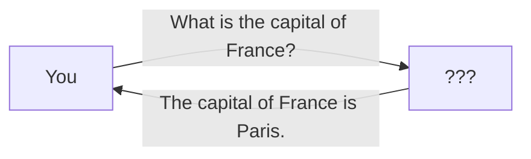

That second step — whatever produced the response — is a black box. To anyone unfamiliar with how these systems work, that black box feels like a single person: someone knowledgeable, up-to-date, and able to respond almost instantly. You type something in. A response comes out, every time. What's inside?

When a human types a response, one person does everything: reads your message, thinks about it, and writes back. An AI assistant creates the same illusion — it feels like a single entity replying to you. But there's no person on the other end. What's actually happening is a handful of separate systems working together, each doing one part of the job. The reply you see is the output of a pipeline, not a mind.

## The Big Picture

There are two major components inside an AI system. At the core is the model. Wrapped around it is the orchestration layer. Let's understand what these terms mean.

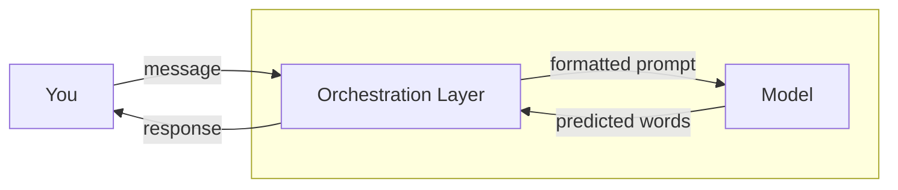

- **The model** is what does the actual thinking — or more accurately, the predicting. Give it some text and it predicts what word should come next, over and over, like an intelligent autocomplete. That's all it does. It doesn't know who you are, can't look anything up, and has no sense of truth or falsehood. It just predicts the next word. When companies announce "Claude Opus" or "GPT-5," they're talking about this component. It's the piece that set off the AI wave post-2020.
- **The orchestration layer** — everything wrapped around the model that makes it useful. It manages conversation history (so you can say "what about Germany?" and it knows you're still talking about capitals), injects instructions, filters harmful content, calls external tools, retrieves documents, and — in the most capable systems — plans and executes multi-step tasks autonomously. At its simplest, it's a conversation manager. At its most powerful, it's an agent. Without it, you'd be talking to a raw next-word predictor — no memory of what you just said, no guardrails, no ability to look anything up. That's why no company lets users interact with the model directly.

These are the only two pieces you need to understand. The model predicts words. The orchestration layer feeds the right text in and makes sure the right text comes out. Every AI assistant — from the simplest chatbot to the most autonomous coding agent — is some variation of this pattern.

Let's look at each in detail, starting with the model.

---

## The Model: A Machine That Predicts the Next Word

At the heart of every AI assistant is something called a **language model**. Despite the fancy name, it does one simple thing: given some text, it predicts what text should come next.

> **A note on terminology.** Under the hood, models work with **tokens** — small fragments of text that sit somewhere between whole words and individual characters. This is done for efficiency: working with word fragments instead of entire words dramatically reduces the number of distinct pieces the model needs to handle. But for the purposes of this document, we'll keep things simple and talk in terms of words. When we say the model predicts the "next word," mentally substitute "next token." The mechanism is identical.

Imagine I show you the phrase:

> *"The capital of France is \_\_\_"*

You'd fill in the blank with "Paris." That's exactly what a language model does — but instead of knowing facts like a person, it learned patterns from reading an enormous amount of text.

And it's not limited to single-word blanks. The same mechanism scales up. Feed it the first nine chapters of a novel and it can write a plausible tenth. Drop in a fifty-page legal contract and ask a specific question — it can pull out the relevant clause and explain it. For a given model, the output depends entirely on the input — feed it different text and you'll get different predictions. But the relationship isn't deterministic. Feed the same input to the same model twice, and you'll likely get two different responses. The model doesn't always pick the most likely next word. Instead, it rolls weighted dice — words with higher probability are chosen more often, but rare words still have a chance. This randomness is what makes responses feel natural and varied. There are knobs to control how much randomness — turn up the "temperature" and the model takes more creative risks; turn it down and it becomes more predictable. But the mechanism is the same regardless. Whatever text you feed in, the model predicts what comes next. That's the whole trick.

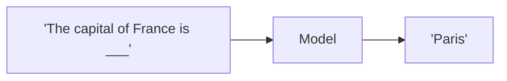

### How It Knows to Predict the Next Text

A model is a mathematical function. It takes in text and predicts what should follow. The prediction depends on two things: the input text you give it, and a set of internal numbers called **parameters** (also called **weights**). For a given model, the parameters are fixed — Claude's parameters never change no matter how many times you use it. But the input text is variable — change what you ask, and the prediction changes with it.

How are those parameters arrived at? They're computed through a process called **training**. During training, the model is shown trillions of words from books, articles, websites, and code. At each step, it tries to guess the next word. When it's wrong, the parameters are nudged to do better next time. After seeing "The capital of France is Paris," "The capital of Germany is Berlin," and "The capital of Japan is Tokyo" enough times, the parameters shift so that "Paris" becomes the most likely word after "The capital of France is." After weeks or months and millions of dollars, the parameters settle into values that capture patterns across the training data. Those final numbers *are* the model. The way it predicts the next word is by looking at the words around it — the neighborhood. During training, every nuance of language — grammar, word order, idioms, factual associations — gets encoded into those parameters. Give it a few words as context, and it predicts the most fitting next word based on the company those words keep. Repeat this — each predicted word becoming part of the context for the next — and you get a complete sentence. This process is called **inference**.

Some AI labs release these parameters publicly. These are called **open weight models**. Anyone can download the weights and run the model on their own hardware — no internet connection, no API key, no company server in the middle. Meta's Llama, Google's Gemma, and Mistral's models are prominent examples.

We're stopping our tour of the model's internals here. For what follows, the key idea is enough: the model breaks text into small pieces called **tokens** and predicts the next token, one at a time, until the response is complete. If you want the full internals — how tokens are formed, how the model decides which token comes next, and what happens inside during each prediction step — the [inference walkthrough](/docs/llm-inference-walkthrough.md) covers it all.

---

## The Simplest Possible System: Just the Model

Imagine the simplest version of an AI assistant — nothing but the raw model. No conversation manager, no safety filters, no tools. Just you and the prediction machine.

Here's what using it would actually feel like.

You type: *"What is the capital of France?"*

The model responds: *"Paris."*

Great. Now you follow up: *"What about Germany?"*

The model: *"I'm sorry, I don't understand the question."*

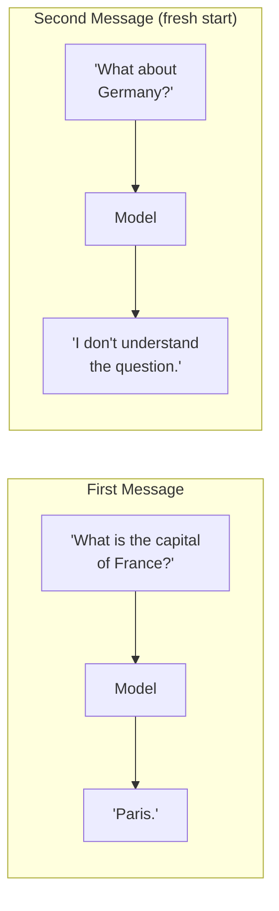

The model only sees what it's given — and here, it's given just the bare message, with no memory of the conversation:

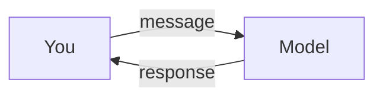

Why? Because the model has no memory. It doesn't know you just asked about capitals. Every message you send is a fresh start — it has no access to anything said before. You'd have to retype the full context every single time: *"I'm asking about country capitals. Previously I asked about France, and you said Paris. Now: what is the capital of Germany?"*

There are other problems too. Ask it to write a poem and it might produce something beautiful — or something genuinely disturbing. It learned from the entire internet, and the internet contains everything. The model doesn't know it's supposed to be helpful. It just predicts text. If the training data contained hate speech, the model might reproduce those patterns. If you ask it for the weather, it'll confidently invent a temperature — it can't look anything up.

A raw model is powerful. But it's also unpredictable, forgetful, and completely unaware of how it's supposed to behave. The orchestration layer exists to fix every one of these problems.

---

## The Orchestration Layer

A raw model predicts words. That's all it does. And as we saw earlier, for a given model, the output depends entirely on the input — the model can only respond to what it's given. The orchestration layer exploits this. Its job is to construct the right input and feed it to the model. That input is called the model's **context**: everything the model can "see" when it generates a response. The rest of this section walks through what goes into that context and how each piece makes the model more useful.

At minimum, the orchestration layer manages the conversation — bundling chat history and injecting instructions about how to behave. Add safety filters, and it blocks harmful content. Add tool support, and it can search the web or run code. Add external memory, and it can retrieve documents or remember facts about you. Add an autonomous execution loop, and it becomes an agent — planning, acting, and iterating until a task is done.

Let's walk through each capability, building from the simplest form to the most powerful.

### Conversation Manager

The first capability the orchestration layer provides is conversation management. It solves the memory problem and the behavior problem.

**Solving memory.** Every time you send a message, the conversation manager bundles it together with all the previous messages in the conversation and sends the whole thing to the model. From the model's perspective, it sees:

```
User: What is the capital of France?
Assistant: The capital of France is Paris.
User: What about Germany?
```

It receives all of this at once. Because it can see the earlier messages, it understands that "What about Germany?" is a follow-up. No more starting from scratch every time.

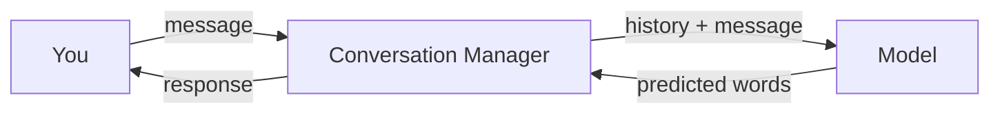

**Solving behavior.** Before your messages reach the model, the conversation manager prepends a hidden message called the **system prompt**:

```
You are a helpful, honest, and harmless assistant.
You answer questions accurately and concisely.
If you don't know something, you say so rather than guessing.
```

The complete context — system prompt at the top, then the conversation:

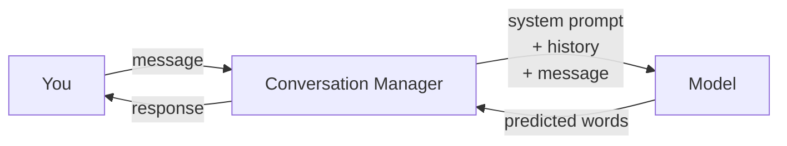

The model doesn't "know" it's an assistant. It receives these instructions as the first part of the text and predicts the next word accordingly. The system prompt is the closest thing to programming an AI — you can't change the model's internal numbers, but you can change the instructions it receives, and it will follow them remarkably well.

---

### Safety Filters

The conversation manager gives the model memory and instructions. But a model told to "be helpful" might still generate something harmful — remember, it was trained on the whole internet. **Safety filters** address this.

**Input filters** check your message before the model sees it. They look for requests for illegal content, attempts to trick the model into ignoring its instructions, or anything that violates usage policies. If something is flagged, it's blocked before it ever reaches the model.

**Output filters** check the model's response before you see it. They look for harmful content, personal information that might have leaked from training data, or copyrighted text the model might have memorized.

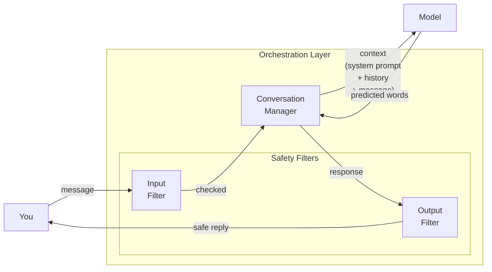

If a filter catches something, you might see a message like "I can't help with that" instead of the raw output. These filters aren't perfect — people constantly find new ways around them, and companies constantly update them. But without them, the system would happily comply with almost any request.

---

### Tools

Even with memory, instructions, and safety, the model has a fundamental limit: it only knows what was in its training data. It can't tell you today's weather, run a calculation, or search the web. Worse, asking the model to do math or look up facts directly produces unreliable results — the model predicts words, not correct answers.

**Tools** fix this. A tool is a trusted, deterministic workflow: give it an input and it reliably produces the correct output, every time. A calculator always returns the right sum. A weather API always returns the actual temperature. A code interpreter always executes the code as written. The model itself doesn't run these tools — it simply decides when one would help and requests it. The orchestration layer passes the list of available tools to the model as part of the context. The model can then either answer directly, or respond with a tool request — essentially saying "call the weather API with these parameters." The orchestration layer carries out the request and feeds the result back into the conversation.

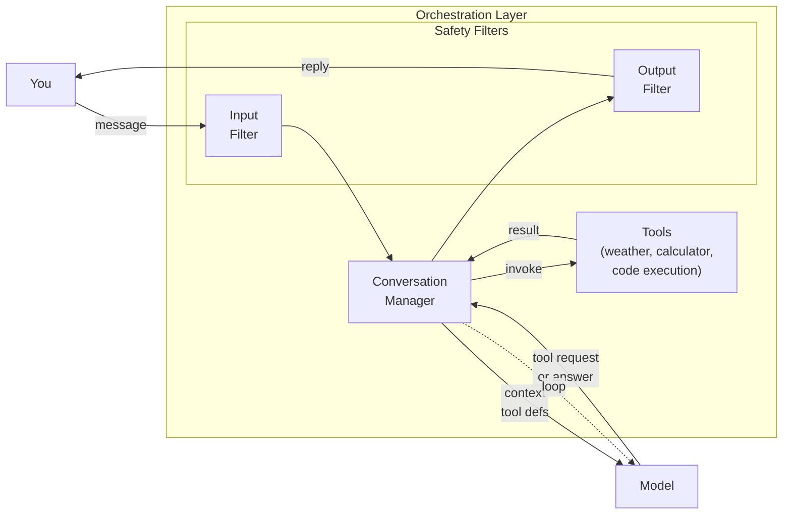

Here's a weather query with tools enabled:

```
1. User: "What's the weather in Tokyo right now?"
2. System formats the message and sends it to the model.
3. Model recognizes it doesn't know the current weather.
   It outputs a signal meaning: "Run the weather tool for Tokyo."
4. System calls a weather API and gets back: "22°C, sunny."
5. System inserts this into the conversation and sends it back to the model.
6. Model now has the information. It generates:
   "It's currently 22°C and sunny in Tokyo."
```

The model doesn't know the weather API exists. It was trained to recognize that when someone asks about current information and a weather tool is available, it should request the tool instead of guessing. The system handles the actual work.

Here's the full tool invocation flow, step by step. The orchestration layer includes a list of available tools in the context it sends to the model — each tool has a name, a description of what it does, and the parameters it accepts. The model reads these definitions alongside the user's message. When it decides a tool would help, it doesn't produce plain text — it outputs a structured signal (often a JSON object) specifying which tool to call and what arguments to pass. The orchestration layer reads this signal, executes the requested tool, and inserts the result into the conversation as if the tool itself had responded. The model now sees this new information and decides: do I need another tool, or can I answer now? This loop — model decides, OL executes, result feeds back — repeats until the model produces plain text. Only then does the OL route the response through the output filter and back to the user.

Common tools include web search, code execution, file access, and API calls to services like calendars or email. A single user request can trigger multiple tools — the model might search the web, run code to analyze the results, and compose a response, all within one turn.

**A note on MCP.** The Model Context Protocol (MCP) is a standard that formalizes this tool-calling interface. Its primary motivation is to standardize the messaging format between the orchestration layer and the model — so any model can talk to any tool without custom integration work. The core idea is exactly what we just described: a common language for the conversation manager to describe available tools, and for the model to request them.

---

### External Memory

The conversation manager remembers what's been said during *this* conversation. But what about across conversations? Or what about a document that's thousands of pages long — far more than fits in a single message?

**External memory** is the broad term for any information the system retrieves from outside the current conversation and injects into the context. It comes in two forms:

**Persistent memory** stores facts about the user across sessions — your name, your preferences, projects you're working on. These facts live in a database and are inserted into the system prompt when relevant. If you once told the AI you're a vegetarian, and later ask for recipe suggestions, it won't recommend steak. Not because the model remembers — because the system injected *"The user is vegetarian"* into the context. Persistent memory is small, personal, and long-lived.

**RAG (Retrieval-Augmented Generation)** is for large collections of documents — company policies, research papers, product manuals. Unlike persistent memory, which stores known facts about the user, RAG searches through documents on demand to find information relevant to the current question. Here's how it works:

1. You have a large collection of documents — company policies, research papers, product manuals.
2. These documents are split into small chunks and stored in a specialized database called a **vector database** — where each chunk is indexed by its meaning, not just its keywords.
3. When you ask a question, the system searches for relevant chunks.
4. The relevant chunks are added to your message: *"Use the following information to answer the question: [chunk 1] [chunk 2]..."*
5. The model reads the chunks along with your question and generates an answer grounded in those documents.

The search works by converting both the documents and your question into lists of numbers (called **embeddings**) that capture their meaning. Documents with similar meanings get similar numbers, so the system can find relevant information even when you use different words than the document does. For example, a chunk about "employee vacation policy" would match a query about "how many days off do I get."

RAG powers enterprise search, customer support bots, and any system that needs to answer questions about information the model wasn't trained on.

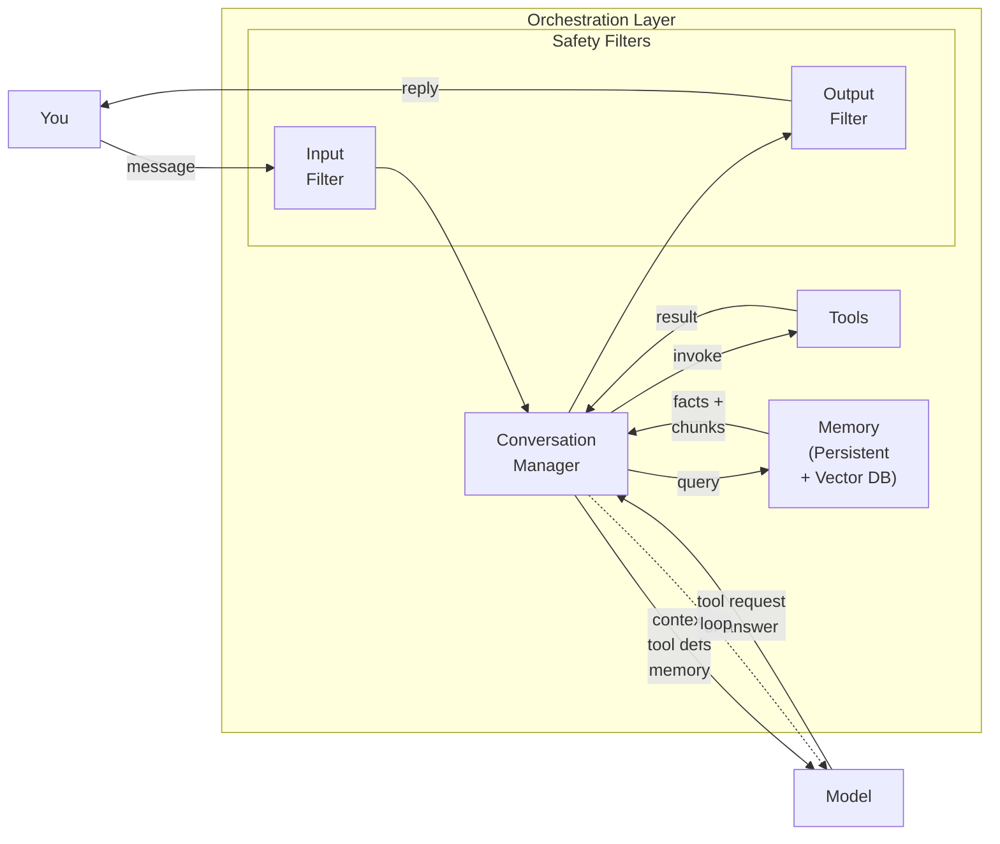

**In Practice:** Ever asked a product chatbot about a return policy and gotten a specific, accurate answer? That's RAG — the system found the relevant policy document, inserted the text into the model's input, and the model summarized it. Without RAG, the model would either refuse to answer or confidently invent a policy that doesn't exist.

---

### The Agent Loop

All the pieces we've seen — conversation management, safety filters, tools, external memory — handle individual requests. You ask, the system responds. But what if you want the AI to handle a task that requires many steps: researching a topic, writing code, testing it, fixing bugs, and only then reporting back?

This is where the orchestration layer becomes an **agent**. An agent uses the same model and the same tools, but instead of stopping after one response, it runs in a loop:

1. **Plan**: Based on the goal, decide what to do next.
2. **Act**: Execute a tool — search the web, run code, read a file.
3. **Observe**: Look at the result. Did it work? What new information is available?
4. **Decide**: Is the goal achieved? If not, go back to step 1.

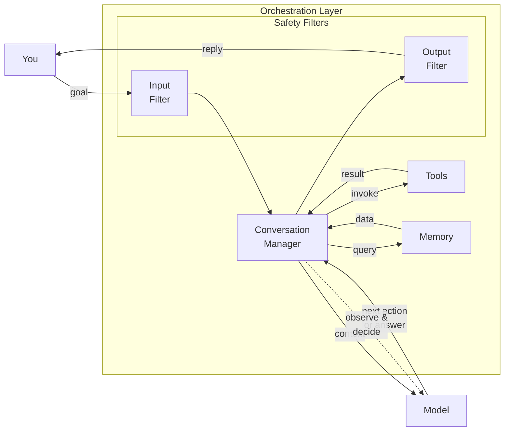

Here's a concrete example. You ask a coding agent: *"Add a dark mode toggle to the settings page."*

```
Step 1: Agent reads the settings page file to understand the current code.
Step 2: Agent reads the existing color definitions and theme system.
Step 3: Agent writes code adding a toggle and the dark mode colors.
Step 4: Agent runs the test suite to make sure nothing is broken.
Step 5: A test fails — the agent reads the error, fixes the bug, and runs tests again.
Step 6: All tests pass. Agent reports: "Done. Added dark mode toggle to settings."
```

Each of those steps is a separate call to the model. The orchestration layer handles the loop — calling the model, executing tools, feeding results back — until the task is complete. The model itself doesn't know it's "in a loop." It just receives each new piece of text and predicts the next word, which might be another tool call or a final answer.

**In Practice:** If you use Claude Code or Cursor, you can watch the agent work — reading files, writing code, running tests, fixing errors. Each visible action is a separate trip through the model. This is why agent tasks take longer and cost more than simple Q&A: you're paying for every step in the loop.

Agents are powerful but tricky: mistakes compound across steps, costs multiply with each model call, and the agent can drift from the original goal. Despite these challenges, agents are the most active area of AI development today. Coding agents like Claude Code and Cursor are the most mature examples, but the same pattern powers research assistants, data analysis tools, and customer support automation.

---

## The Full System

We started with just the model — powerful but forgetful, unpredictable, and limited to its training data. Then we added the orchestration layer, capability by capability:

- **Conversation management** gave it memory and a sense of how to behave.
- **Safety filters** stopped it from producing harmful content.
- **Tools** let it reach beyond its training — searching the web, running code.
- **External memory** let it remember facts across sessions and search through documents.
- **The agent loop** gave it the ability to plan and execute multi-step tasks autonomously.

Not every request uses every capability. *"What is the capital of France?"* flows through conversation management, safety filters, and the model — no tools or external memory needed. *"Summarize the latest climate research from our internal reports"* would touch everything, including the agent loop. The orchestration layer scales up or down depending on what the request demands.

---

## Putting It All Together

Let's trace one complete request through the full system to see how all the pieces connect. Imagine you ask:

> *"What's the latest on the Mars sample return mission? Make a timeline."*

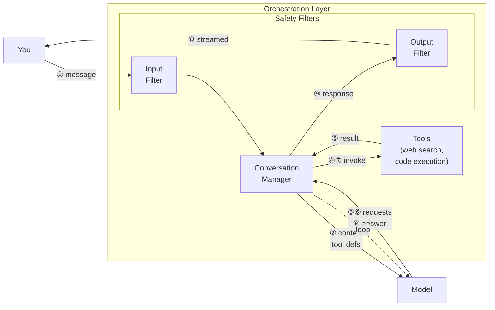

Here's the entire journey:

1. **Input safety filter** checks your message. It's a reasonable question — allowed through.

2. **Orchestration layer** formats everything: the system prompt (hidden instructions about being helpful and accurate), the tool definitions (web search and code execution are available), the conversation history (empty, since this is a new chat), and your message.

3. **Model** receives all of this text. It recognizes that "latest" means current information is needed, and a web search tool is available. It outputs a tool request for a web search.

4. **Orchestration layer** executes the search, gets back several articles about the Mars sample return mission, and inserts the article text into the conversation.

5. **Model** reads the articles and generates a text summary of the mission status and key dates.

6. **Model** then recognizes that a timeline was requested. It outputs a tool request to run Python code that generates a formatted timeline.

7. **Orchestration layer** runs the code and inserts the result — a text-based timeline — into the conversation.

8. **Model** reviews everything and composes a final response: a summary paragraph followed by the formatted timeline.

9. **Output safety filter** checks the response. It contains factual information about a space mission — no issues detected.

10. **Response is streamed** to the user, word by word, appearing on screen as it's generated.

The model predicted words. The orchestration layer handled everything else. Every AI product you use — ChatGPT, Claude, Gemini, Cursor, Copilot — follows some variation of this same pattern.

---

## Seeing and Hearing: Beyond Text

So far, we've only talked about text. But modern AI systems can also understand images, audio, and video. A system that works with multiple types of input is called **multimodal**.

### How a Model "Sees" Images

When you upload a photo to an AI assistant and ask "What's in this picture?", here's what happens:

1. The image goes through a separate piece of software called a **vision encoder**. This converts the image into a long list of numbers — the same kind of representation the model already uses for text tokens.
2. These "image tokens" are placed alongside your text tokens: *[image data] "What's in this picture?"*
3. The model processes everything together, attending to relevant parts of the image as it generates each word of its response.

The model wasn't born knowing what a cat looks like. During training, it was shown millions of images paired with descriptions: a photo of a cat labeled "A cat sitting on a windowsill." Through enough examples, it learned to associate visual patterns with words. The same "predict the next token" mechanism that works for text also works when some of those tokens represent image data.

Vision-capable models can:
- Describe what's in a photo
- Read text from screenshots and documents
- Answer questions about charts and diagrams
- Identify objects, people, and scenes

### Audio and Video

Audio works the same way. An audio encoder converts sound into number sequences. The model processes these alongside text tokens, enabling speech recognition, voice tone analysis, and — in some systems — direct voice conversations where you speak and the AI speaks back.

Video is treated as a sequence of still images. Each frame goes through the vision encoder, and the model tracks changes across frames to understand motion, action, and events over time.

### What About Creating Images?

The systems we've described so far are **understanding-only**: they take in images or audio but only output text. Image generation — turning "a watercolor painting of a lighthouse at sunset" into an actual image — is handled by completely different types of models (like DALL-E, Midjourney, or Stable Diffusion). These are separate systems, often called by the main AI assistant as a tool, not built into the model itself.

Some newer models are starting to unify understanding and generation in a single system, but for now, most AI products connect a text-understanding model to separate generation models behind the scenes.

---

## What This Means in Practice

### Three Things to Remember

**1. The model doesn't know — it predicts.** When an AI gives you an answer, it's not retrieving a fact from a database. It's generating text that follows patterns from its training data. This is why it can be brilliantly right and confidently wrong in the same conversation. Treat it like a very smart intern with perfect recall of everything they've ever read — but no way to check if any of it is true.

**2. Without tools, the model is frozen in time.** It knows nothing that happened after its training cutoff date. It can't check today's weather, look up a stock price, or verify a recent news story. Any system that seems "current" is using tools — web search, retrieval, or code execution — behind the scenes. The model isn't searching. Something else is, feeding the model the results.

**3. The quality of the output depends on the quality of the input.** A vague question gets a vague response, no matter how advanced the model is. Specific instructions, relevant context, and clear examples improve output quality more than switching to a larger model. This is why prompt engineering matters.

### Real Systems at a Glance

| System | Context Window | Key Features |
|--------|---------------|--------------|
| ChatGPT | 128K tokens | Multimodal (vision, voice), web search, code execution, persistent memory |
| Claude | 200K tokens | Long documents, tool use, code execution, extended thinking |
| Gemini | 1M tokens | Largest context window, audio and video natively |
| Copilot / Cursor | 128K–200K | Code-focused agent loops, file system access, terminal execution |

All of them follow the same architecture covered in this document: model + orchestration layer. The differences are in training data, system prompt, available tools, and the sophistication of their agent loops.

### What to Watch For

- **Hallucinations (confident wrong answers).** The model will confidently state incorrect facts when its training data contained enough text that *sounds* right. Always verify critical information before acting on it.
- **Drift (in long agent tasks).** When an agent runs for many steps, it can lose track of the original goal. Breaking large tasks into smaller ones with explicit checkpoints helps.
- **Bias (skewed patterns).** Training data contains human biases, and the model reproduces them. Different providers mitigate this to varying degrees, but none eliminate it. Be especially careful when using AI for decisions about people — hiring, lending, grading.

---

## Where to Go Next

We started with "What is the capital of France?" and worked our way up through the full architecture — model and orchestration layer, conversation management, safety filters, tools, external memory, agent loops, and multimodal capabilities. This document was a map. If you want to go deeper:

- **How does the model actually predict the next word?** The [inference walkthrough](/docs/llm-inference-walkthrough.md) takes you inside the model, step by step — from turning text into numbers, through the attention mechanism that figures out which words relate to which, to how the model produces the final prediction.

- **How is the model trained?** The [training walkthrough](/docs/llm-training-walkthrough.md) covers the full pipeline — from filtering raw internet text, through pre-training on trillions of words, to the fine-tuning and alignment stages that turn a raw model into a helpful assistant.

- **How do you inspect a real model?** The [Gemma 4 notebook](/notebooks/gemma4_transformer_internals.ipynb) lets you load an actual AI model and look inside — tracking how its understanding of text evolves layer by layer, visualizing what it pays attention to, and experimentally modifying its behavior.