# How LLMs Generate the Next Token

*A step-by-step walkthrough of transformer inference — from tokenization to emergence.*

---

When you give an LLM a prompt — say, the most famous example in AI, "The cat sat on the" — it fires back an answer like it understands you. It fills in the blank. "mat." But what's actually happening inside? Not the vague hand-waving. Not "it was trained on the entire internet." We're going to dive into the nitty-gritty details — what exactly is the computer doing, step by step, when it comes up with the next word?

---

## The Short Answer

Here's the short answer, and then we'll walk through every piece of it. An LLM takes in a sequence of tokens, and predicts the next token. That's it. That's the whole job. All of it — the knowledge, the reasoning, the creativity — it all comes from doing that one simple thing at a scale that's honestly hard to wrap your head around.

---

## The Journey Ahead

We'll feed in a sample prompt — *"The cat sat on the"* — and take a journey through the model to see the path it takes to produce the next token. Along the way, we'll understand each piece of the pipeline: how text becomes numbers, how those numbers gain meaning, how the model decides which parts of the input matter, how all of this stacks into a deep tower of computation, and how the final result gets turned back into a word. We'll also touch on how the model learned all of this in the first place, and why predicting the next token — at massive scale — produces something that looks a lot like understanding.

---

## What We Won't Cover

A few things we're deliberately leaving aside:

- **Training in depth.** Training gets a brief treatment at the end for context, but the focus is on *inference* — what happens when you hit enter on a prompt. Training involves backpropagation, gradient descent, distributed compute, and data curation — each a topic worthy of its own post.
- **Prompt engineering or practical usage.** No tips for writing better prompts. This is a mechanistic tour of the internals, not a user guide.
- **Specific APIs (OpenAI, Anthropic, etc.).** The architecture described is the GPT family's decoder-only transformer, but the concepts generalize across all modern LLMs. We're talking about the machine, not any particular product wrapping it.
- **History of AI.** We start with the transformer. No perceptrons, no LSTMs, no BERT — the focus is narrow and deep.
- **Safety, alignment, or ethics.** Important topics, but outside our scope.
- **Agents, harnesses, and product wrappers.** When you use ChatGPT or Gemini, you're not talking directly to the model. You're talking to an *agent* — a harness that wraps the model in a chat interface, manages conversation history, enforces system prompts, calls tools, runs web searches, and applies content filters. The model itself has no concept of a "conversation" — it just receives tokens and predicts the next one. The agent is what stitches those predictions into a coherent dialogue and decides when and how to invoke the model. We're here to understand the engine, not the car built around it.

With that out of the way, let's begin.

---

## What Is a Model, Really?

LLM stands for Large Language Model. The word "model" matters. It's not a person. It's not conscious. It's a mathematical function — a very, very big one, with billions of learned parameters. When we say "the model," that's all it is. A giant function. Tokens in, tokens out.

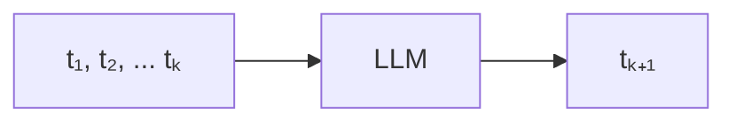

The diagram above shows one step of the LLM — what's called a **decode step**. The model takes the tokens it has so far and predicts the next one. It then appends that predicted token to the input and runs another decode step. So when does it stop? The vocabulary includes a special token — often called EOS (end of sequence) — that means "I'm done." When the model samples this token, generation halts. If it never does, there's usually a hard cutoff that stops the loop anyway.

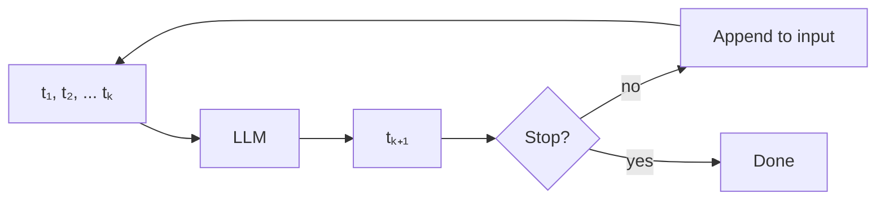

This is called **auto-regressive generation**. The name sounds technical, but the idea is simple: the model's own output becomes part of its next input. It feeds on itself — one token at a time. A hundred-word answer? This loop ran a hundred times. And every time it runs, the model can look at every token that came before — the entire conversation so far.

---

## Step 1: Tokenization — The Character–Word Spectrum

We've established that the model takes tokens in and spits tokens out. But so far "token" has been an abstract idea. So what exactly *is* a token?

A token is a sub-word unit — a chunk of text that's bigger than a single character but often smaller than a full word. Common words like "the" or "cat" might each be their own token. Longer or rarer words get split into pieces — "playing" might become `["play", "ing"]`. The set of all possible tokens a model knows is called its vocabulary, and it's built by an algorithm, not written by hand.

The vocabulary is decided *before* training — the algorithm runs over the training corpus and settles on a fixed set of tokens. This vocabulary is then baked into the model: the input and output layers are literally sized to match it. If you have 50,257 tokens, the model has exactly 50,257 slots on both ends. Change the vocabulary, and you'd need to retrain.

LLMs don't see words. They don't see characters. They see these sub-word tokens. As a rough rule of thumb, one English word works out to about 1.3 to 1.5 tokens on average — common short words are one token, longer or rarer words are two or more.

Here's why tokens exist:

- **If the model worked with individual characters**, sequences would be impractically long. Even a short sentence would balloon into dozens of steps. The model would be slow and would struggle to see patterns across long distances.
- **If it worked with whole words**, the vocabulary would be millions of words. Too many to be practical.

So we compromise. An algorithm builds a vocabulary of about 50,000 tokens — small enough to be efficient, large enough to capture meaning. GPT-3's vocabulary size is exactly **50,257 tokens**.

### Walking Through an Example

Let's tokenize our prompt: `"The cat sat on the"`. After the tokenizer has done its work, each word (or piece of a word) maps to a token. Common words like "The" and "cat" each become a single token. The output is a sequence of five integers:

```
"The"    →  464
" cat"   → 3797
" sat"   → 6234
" on"    →  319
" the"   → 1169
```

Notice the leading spaces on `" cat"`, `" sat"`, and `" on"` — the tokenizer bakes spaces directly into the tokens that follow them. This way, "The cat" becomes two tokens (`["The", " cat"]`) rather than three (`["The", " ", "cat"]`). The space is carried along inside the token itself, so the model doesn't need to explicitly generate whitespace — it comes for free when the right token is picked.

This means `"cat"` and `" cat"` are actually two different tokens in the vocabulary — one for when the word starts a sentence (no space), and one for when it follows another word (with space). The model learns to pick the right variant based on context.

### Handling Ambiguity

What happens when a prefix could split multiple ways? If both `"re"` and `"react"` are in the vocabulary, which one wins? The tokenizer uses **greedy longest-match**. Here's how it works:

Starting at the first character of the input, the tokenizer scans forward and finds the *longest* token in the vocabulary that matches the beginning of the remaining text. It emits that token, jumps ahead past it, and repeats.

Take the word `"reacting"` with a vocabulary that contains `["re", "act", "ing", "react"]`:

1. Start at position 0: `"reacting..."` → longest match is `"react"` (4 chars, beats `"re"` at 2). Emit `["react"]`.
2. Advance to position 4: `"ing"` → longest match is `"ing"`. Emit `["react", "ing"]`.
3. No text left. Done.

Now `"re-do"` with the same vocabulary:

1. Start at position 0: `"re-do"` → longest match is `"re"` (2 chars, `"re-"` isn't in the vocab). Emit `["re"]`.
2. Advance to position 2: `"-do"` → longest match is `"-"`. Emit `["re", "-"]`.
3. Advance to position 3: `"do"` → match is `"do"`. Emit `["re", "-", "do"]`.

Simple rule, deterministic output — no ambiguity.

### Byte-Pair Encoding (BPE)

How is this vocabulary built? The algorithm runs on the *training corpus* — which, in practice, is essentially everything on the internet: books, articles, code, forums, and more. It starts with individual characters as the base vocabulary. Then it scans this massive corpus and finds the most common pair of adjacent tokens across the entire dataset. It merges them into a new token. Then it scans again, finds the next most common pair, and merges again. Over and over, thousands of times:

- `T + h → Th`
- `Th + e → The`
- `t + h → th`
- `th + e → the`

Common words get their own token. Rare words get split into pieces. Take the word "mat" — it's common enough to get its own token. But a rarer form like "mats" might get split into `["mat", "s"]`.

BPE is the most common choice today (used by GPT models, Llama, and many others), but it's not the only one. Other approaches exist — WordPiece (used by BERT), Unigram (used by some multilingual models), and SentencePiece (which handles the whole pipeline including whitespace). The core idea is the same across all of them: build a fixed vocabulary of sub-word units from the training data, and use it to chop text into tokens.

### Tokenization Has Real Consequences

Tokenization creates a blind spot: since the model sees `[straw] [berry]` and not individual letters, it has no direct access to character-level detail. If you ask a base model how many R's are in "strawberry," it will often get it wrong — there's an R in "straw" and two in "berry," but the model can't just look. It has to reconstruct the spelling from statistical patterns. This is also why LLMs struggle with spelling tasks and anagrams. (Modern reasoning models can work around this by thinking step-by-step and spelling words out character by character — but the underlying limitation is real.)

Once the vocabulary is built, the tokenizer is just a fixed piece of code — its merge rules and greedy matching logic don't change. Before the model does anything, the tokenizer converts your prompt into a list of integers. And at the very end, after the model produces a new token ID, the detokenizer does a simple reverse lookup — mapping that integer back to text. Think of it as the front door (tokenizer) and the back door (detokenizer). Everything in between is handled by the model.

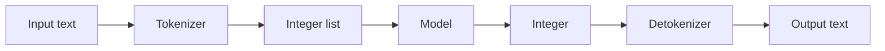

Every conversation you've ever had with an LLM? At the boundary — where text enters and where text comes out — it's just a long list of integers.

So here's what the model actually receives for our prompt:

| Token ID | Token  |
|----------|--------|
| 464      | "The"  |
| 3797     | " cat" |
| 6234     | " sat" |
| 319      | " on"  |
| 1169     | " the" |

The full vocabulary is a lookup table — about 50,000 rows, mapping every token to an integer between 1 and 50,257. That's all the model ever sees. Not words. Not meaning. Just numbers. Our prompt becomes `[464, 3797, 6234, 319, 1169]` — five integers. That's it.

---

## Step 2: Embeddings — Turning Integers Into Meaning

*Embeddings answer: "What does this token mean?"*

### Why Raw Token IDs Aren't Enough

We now have a list of integers — `[464, 3797, 6234, 319, 1169]`. But a single integer like `3797` can't carry much information. It just says "this is token number 3797." It doesn't say what the word means, what it's related to, or how it behaves in a sentence. The model needs a much richer representation — something that can capture that "cat" is an animal, that it's similar to "dog" but different from "car," that it can sit on mats and chase mice. One number can't do all of that.

So instead of using the raw token ID, the model maps it into a **high-dimensional vector** — a list of hundreds or thousands of numbers. This is called an **embedding**. In this high-dimensional space, meaning is encoded as position — similar concepts end up close together, unrelated concepts far apart. The embedding is the model's internal "map" of language, and it's the foundation for everything that follows.

### The Embedding Matrix

Under the hood, this map is stored as a matrix — typically called the **embedding matrix** or `Wₑ`. Its size is `vocabulary_size × embedding_dimension` — 50,257 rows by 12,288 columns. Each row is the embedding vector for one token. The token ID is simply a row index: ID 464 picks row 464, ID 3797 picks row 3797. Every one of those ~617 million numbers is a learned parameter, tuned during training.

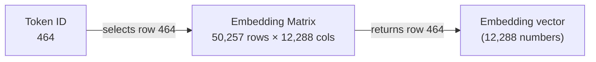

### How Embeddings Capture Meaning

These vectors aren't random. They are the model's understanding of individual words, and they capture the kind of relationships we intuitively grasp as humans.

Think about how you understand the words "happy" and "glad." You know they're similar — both describe a positive emotion. But they're not identical. "Happy" might lean more toward a sustained state; "glad" often carries a sense of relief. You've learned this distinction not from a dictionary, but from seeing how these words are used in different sentences over a lifetime.

Embeddings work the same way. "Happy" and "glad" sit close together in the embedding space — much closer than "happy" and "angry" — but not at the exact same spot. The slight distance between them encodes the subtle difference in how they're used. Words describing opposite emotional states, like "joyful" and "miserable," end up far apart because they consistently appear alongside very different neighboring words — "joyful celebration" vs. "miserable failure."

Words with similar meanings cluster together:

- "Cat" and "dog" sit near each other.
- "Car" and "vehicle" are neighbors.
- "Happy" and "joy" are close.

A quick note on consistency: earlier we saw that `"cat"` and `" cat"` are different token IDs. They are — but their embedding vectors will be *very* similar, because they represent the same concept. The same goes for `"Cat"`, `"CAT"`, and `"cat"` — different IDs, but their embeddings cluster tightly together. The model learns that these surface-level differences don't change what the word means.

The model learned these relationships purely from seeing words appear in similar contexts — "the cat sat" and "the dog sat" — millions of times across the training data. If two words are consistently surrounded by the same neighbors, their embeddings drift toward the same region of space. Nobody wrote a rule saying "cats and dogs are both pets." The geometry emerged from raw statistics.

This is how the model understands relationships between concepts — not through rules or grammar, but through distances in a 12,288-dimensional space.

### The Limitation: Context-Free

There's an important limitation here, though. The embedding for "mat" is the same whether it appears in "the cat sat on the mat" or "he rolled out his yoga mat." The model hasn't yet looked at the surrounding words — it's still operating on each token in isolation. Embeddings give the model a static understanding of words. To grasp what "mat" means *in this specific sentence*, the model will need to let tokens see each other. We'll build up to that. But first, there's another gap: the model doesn't yet know the order of the words.

---

## Step 3: Positional Encoding — Where Each Token Sits

*Positional encoding answers: "Where am I in the sequence?"*

Embeddings capture what a word *means*, but not *where* it sits. Remember, the model will be looking at all the token embeddings together — it needs to know which one came first, which came second, and so on. Without that information, it's just staring at a bag of words. Swap "cat sat" to "sat cat" — the embeddings are identical, and the model has no way to tell the difference. For a system whose entire job is to predict what comes next, this is a critical blind spot.

### The Fix: Positional Encoding

Here's the idea: for each position in the sequence, we generate a unique vector of the same size as the embedding (12,288 numbers). This vector is computed mathematically — no learning involved — and gets added directly to the token's embedding. The result is a new vector that carries both *what the word is* and *where it sits*.

### The Formula

How is the pattern built? It starts with a simple formula. For each token position `pos` in the input — 0 for the first token "The", 1 for " cat", 2 for " sat", and so on — and each dimension index `i` in the embedding vector:

- Even dimensions use sine: `PE(pos, 2i) = sin(pos / 10000^(2i / d_model))`
- Odd dimensions use cosine: `PE(pos, 2i+1) = cos(pos / 10000^(2i / d_model))`

Where `10000^(2i/d_model)` means 10000 raised to the power of `(2i/d_model)` — exponentiation, not XOR.

### Why 10000?

It's a hyperparameter from the original transformer paper. It sets the range of wavelengths: the fastest dimensions complete a full cycle in about 6 positions, while the slowest ones take over 60,000 positions to repeat. This gives the model a broad spectrum — some dimensions encode "who's next to who" and others encode "how far apart are we in the grand scheme of things." The exact value isn't magic; other choices work too, but 10000 became the standard.

### Fast and Slow Dimensions

To make this concrete, here's what the encoding looks like for the first few positions across a handful of dimensions:

| pos | PE(pos, 0) | PE(pos, 1) | PE(pos, 2) | ... | PE(pos, 12287) |
|-----|------------|------------|------------|-----|----------------|
| 0   | sin(0 / 10000⁰) = 0.00 | cos(0 / 10000⁰) = 1.00 | sin(0 / 10000^(2/12288)) = 0.00 | ... | sin(0 / 10000^(12287/12288)) = 0.00 |
| 1   | sin(1 / 10000⁰) = 0.84 | cos(1 / 10000⁰) = 0.54 | sin(1 / 10000^(2/12288)) = 0.84 | ... | sin(1 / 10000^(12287/12288)) ≈ 0.00 |
| 2   | sin(2 / 10000⁰) = 0.91 | cos(2 / 10000⁰) = −0.42 | sin(2 / 10000^(2/12288)) = 0.91 | ... | sin(2 / 10000^(12287/12288)) ≈ 0.00 |
| 3   | sin(3 / 10000⁰) = 0.14 | cos(3 / 10000⁰) = −0.99 | sin(3 / 10000^(2/12288)) = 0.14 | ... | sin(3 / 10000^(12287/12288)) ≈ 0.00 |
| 4   | sin(4 / 10000⁰) = −0.76 | cos(4 / 10000⁰) = −0.65 | sin(4 / 10000^(2/12288)) = −0.76 | ... | sin(4 / 10000^(12287/12288)) ≈ 0.00 |
| 5   | sin(5 / 10000⁰) = −0.96 | cos(5 / 10000⁰) = 0.28 | sin(5 / 10000^(2/12288)) = −0.96 | ... | sin(5 / 10000^(12287/12288)) ≈ 0.00 |
| 6   | sin(6 / 10000⁰) = −0.28 | cos(6 / 10000⁰) = 0.96 | sin(6 / 10000^(2/12288)) = −0.28 | ... | sin(6 / 10000^(12287/12288)) ≈ 0.00 |
| 7   | sin(7 / 10000⁰) = 0.66 | cos(7 / 10000⁰) = 0.75 | sin(7 / 10000^(2/12288)) = 0.66 | ... | sin(7 / 10000^(12287/12288)) ≈ 0.00 |

Look at the first two columns: the values bounce wildly from one row to the next — 0.00 → 0.84 → 0.91 → 0.14 → −0.76. These dimensions encode fine-grained local order — position 5 and position 6 are unmistakably different. Now scan across to the last column: every entry is nearly 0.00, all the way to position 7. These slow dimensions barely move across nearby tokens but vary meaningfully over hundreds of positions.

Why have both? The model's job is to predict the next token, which means it constantly needs to weigh which previous tokens matter. Consider two scenarios.

In the sentence "The cat sat on the mat," the word "sat" is right next to "on" (positions 2 and 3). The model needs to know they're neighbors — that's where the fast dimensions shine. Their values change dramatically in a single step, making adjacent positions easy to distinguish.

But what about a long paragraph where the first sentence describes a cat and the last sentence says "it purred"? The word "it" at position 200 needs to connect back to "cat" at position 2. The fast dimensions are no help here — at position 200, the fast sine wave has cycled dozens of times and might happen to land near the same value as position 2. That's a collision. The slow dimensions save the day: their values have been creeping upward steadily from positions 2 to 200, giving the model a reliable sense of distance. They act like a clock that ticks slowly enough to never repeat within the sequence length.

Together, every position gets a fingerprint that carries both local precision ("who's right next to me?") and global distance ("how far back is that earlier mention?").

These vectors get added to each token's embedding, giving every token a "where am I" signature without overwriting what the word means. The embedding answers *what* a token is. The positional encoding answers *where* it sits. Together, they give the attention mechanism — coming up next — everything it needs to decide *which* other tokens to focus on.

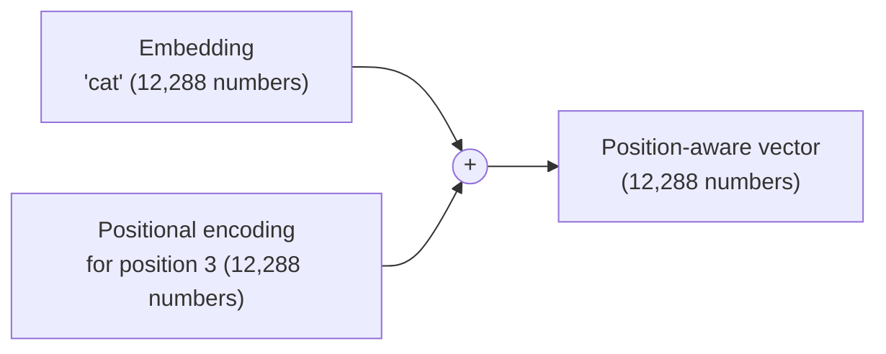

### Why Sine Waves?

So why sine waves instead of just numbering positions 1, 2, 3? To be fair, numbering positions does give the model positional information — position 5 is different from position 6. And it shares the same linear-relationship property: position 8 is always position 5 plus 3.

The advantage of sine waves is subtler. Because they're bounded between -1 and 1, they never produce values far outside the range the model is used to — no matter how long the sequence gets. An integer position like 10,000 could destabilize the model if it was trained on shorter sequences where positions never exceeded, say, 512. The bounded nature of sine waves makes them more robust to variable-length inputs.

That said, sine waves aren't the only choice. Many modern models use **learned positional embeddings** — they just train a unique vector for each position up to the maximum sequence length, the same way they train token embeddings. Others use more recent techniques like **RoPE** (Rotary Position Embedding), which takes a different approach to encoding position. The core idea is the same across all of them: give the model a way to know where each token sits. For the rest of this document, we'll stick with the sinusoidal approach — it's what GPT-3 uses, and it makes the mechanics clearest to understand.

### Putting It Together

Positional encoding isn't learned — it's pure math, computed once for every position the model supports. But it's what gives the model a sense of sequence — of what comes first, second, third.

With both meaning and position encoded, the vectors are ready for the next step: attention.

---

## Step 4: Attention — The Superpower

*Attention answers: "Which other tokens matter to me?"*

So far, we've taken our prompt "The cat sat on the" and turned it into five vectors, each encoding both meaning and position. But these vectors are still isolated — "cat" doesn't know "sat" is next to it, and "the" doesn't know an animal is doing the sitting. In our prompt, the word "sat" strongly hints that an object or location is coming next — but to know *which* object, the model needs to see that "cat" is nearby and "on" sets up a spatial relationship. Each token needs to look at the other tokens and gather relevant information from them.

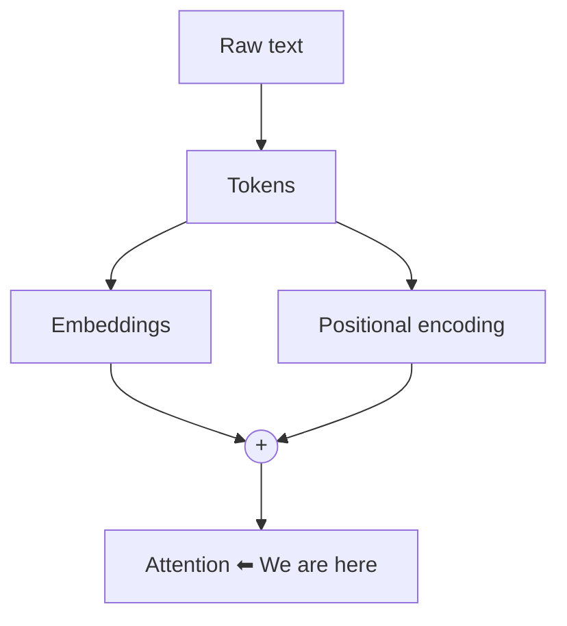

This is where **attention** comes in — the LLM's superpower and what made the transformer architecture (the **T** in GPT) a breakthrough.

> **A quick note on layer normalization:** Before a vector enters the attention block, it passes through a step called layer normalization. This scales the numbers so they have a mean of zero and a standard deviation of one, preventing values from exploding as they pass through many layers. We'll cover it properly when we assemble the full transformer layer. For now, just know it happens — it doesn't change the core attention mechanics we're about to describe.

### The Big Picture

Every token starts with a vector that encodes its meaning and position, but in isolation. Attention lets each token look at all the other tokens and compute a **context delta (ΔX)** — an adjustment to its own vector that reflects what it learned from the surrounding words. This delta gets added to the original vector, enriching it with context. After attention, a token that started as just "the" now carries signals from "cat," "sat," and "on," because those words told it what kind of object is probably coming next.

Before we dive into the mechanics, a quick note: what follows first describes a **single attention head** working with the full 12,288-dimensional vectors. In a real model, there are multiple heads, each operating on a smaller slice. We'll get to multi-head attention after we understand the single-head version — because the core idea is identical and much easier to visualize with just one head.

### Query, Key, and Value

How does attention compute this delta? Each token takes its input vector and produces three new vectors from it.

First, it creates a question: "given what I am, what kind of information would help me right now?" This is the **Query (Q)**.

Second, it creates a label for matching: "if another token is looking for something, check me against this." This is the **Key (K)**.

Third, it prepares the information to contribute: "if I turn out to be relevant, take this." This is the **Value (V)**.

Think of it like a search engine. The Query is what you type into the search bar. The Key is the title and description of each result — that's what gets matched against your query to decide relevance. The Value is the actual page behind the link — the content you get once you've decided to click. The Key determines *whether* you find something. The Value is *what* you get from it.

### From Input to Q, K, V

Under the hood, each of these three vectors is produced by a simple matrix multiplication:

```
Input vector X:          [1 × 12,288]   (one token's embedding + position)
Weight matrix W_Q:       [12,288 × 12,288]
Weight matrix W_K:       [12,288 × 12,288]
Weight matrix W_V:       [12,288 × 12,288]

X · W_Q  →  Q   [1 × 12,288]
X · W_K  →  K   [1 × 12,288]
X · W_V  →  V   [1 × 12,288]
```

The same `W_Q`, `W_K`, and `W_V` are used for every token. What changes is the input vector X, so each token produces its own unique Query, Key, and Value. These weight matrices aren't something we design — they are learned during the training phase, like all the other parameters in the model. Every number was discovered through trillions of prediction attempts and tiny corrective nudges. The goal of all three is the same: produce a ΔX — the context delta — that gets added to the original input.

### What These Matrices Represent

- **X** is the input vector to the attention block — embedding plus positional encoding, as we've described. Going forward, we'll refer to this simply as the input vector.
- **W_Q** is a learned matrix of questions. Each of its 12,288 columns defines one type of question — "is there an animal nearby?", "what action is happening?", "who is the subject?".
- **Q** is a 12,288-number vector — the questions *this specific token* is asking. Each number is the intensity of one question. The token "on" knows it's a preposition, so its Query activates questions like "what object follows a spatial relationship?" while de-emphasizing ones like "what action is being performed?".
- **W_K** is a learned matrix of identifiers. Each column defines one type of identifier a token can broadcast — "I am an animal," "I am an action," "I am a location."
- **K** is a 12,288-number vector — the identifier for *this specific token*. "Cat" produces a Key that scores highly on "I am an animal" and low on "I am an action." When "on"'s Query dot-products against it, the match is strong.
- **W_V** is a learned matrix of information types — what a token can contribute if deemed relevant.
- **V** is a 12,288-number vector — the information *this specific token* carries. For "cat," its Value carries feline-specific features — small, furry, four-legged, known to sit on things.

Why do we need a separate Value when we already have the embedding? The embedding represents a token's meaning in general. The Value, through W_V, transforms the embedding into a form optimized specifically for being summed into a context delta — amplifying useful features and suppressing irrelevant ones.

### Step-by-Step Computation

With Q, K, and V in hand, here's how attention computes the context delta:

1. Every token computes its **Query**, **Key**, and **Value** — three distinct vectors, each produced by its own matrix multiplication.
2. A token's **Query** is compared against every token's **Key** using a **dot product**, producing a raw score for each. To keep the numbers from growing too large, each score is divided by √d (√12288 ≈ 111). This is **scaled dot-product attention**.
3. The scaled scores are **normalized** via softmax into weights that sum to 1. These weights are the attention pattern — how much this token cares about each other token.
4. Each token's **Value** (a completely separate vector, not a result of Q·K) is multiplied by its weight. High-weight Values contribute more; low-weight Values contribute less.
5. All the weighted **Values** are **summed** together into a single vector — the context delta.

This mechanism is called **self-attention** — each token attends to every token in the same sequence, including itself. The Queries, Keys, and Values all come from the same set of input tokens.

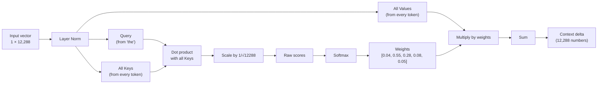

### A Concrete Example

Let's trace this with our prompt "The cat sat on the." The model is trying to predict the next token. The last token — "the" at position 4 — needs to figure out what might follow.

"the" creates a Query. Every token (including "the" itself) creates a Key and a Value. The Query compares itself against all five Keys:

| Token (pos) | Key says...                                          | Raw score | After softmax (weight) |
|-------------|------------------------------------------------------|-----------|------------------------|
| "The" (0)   | "I start the sentence, I'm a determiner"             | 0.5       | 0.04                   |
| " cat" (1)  | "I'm an animal, a feline, a pet"                     | 3.2       | 0.55                   |
| " sat" (2)  | "I'm an action involving position"                   | 2.1       | 0.28                   |
| " on" (3)   | "I set up a spatial relationship"                    | 0.8       | 0.08                   |
| " the" (4)  | "I'm another determiner, the object is coming"       | 0.6       | 0.05                   |

The scores are normalized via softmax into weights. "Cat" and "sat" dominate — they tell "the" that an animal performed a sitting action on something, which strongly suggests a surface.

Each Value is multiplied by its weight and everything is summed. The result is the context delta — a vector that combines cat-information at 55%, sat-information at 28%, and smaller contributions from the rest.

This happens for every token in parallel. "The," "cat," "sat," "on," and the second "the" each produce their own Query, compute their own attention weights, and get their own ΔX. At the end of attention, every token walks away with a richer understanding of the sentence.

In matrix form, all five tokens are processed at once:

```
X:         [5 × 12,288]            (all five token vectors stacked)
Q = X · W_Q   →   [5 × 12,288]
K = X · W_K   →   [5 × 12,288]
V = X · W_V   →   [5 × 12,288]

Scores  = (Q × K_transpose) / √d   →   [5 × 5]    (every token vs every token)
Weights = softmax(Scores)           →   [5 × 5]    (rows sum to 1)
ΔX      = Weights × V               →   [5 × 12,288]
```

The 5×5 scores matrix is the full attention pattern — each row is how much one token attends to every other token (including itself).

### A Note on Interpretations

The descriptions of Keys like "I'm an animal, a feline, a pet" are for our pedagogical understanding. In practice, Q, K, and V are just numbers. A Key isn't a sentence you can read; it's a 12,288-dimensional vector that learned to produce the right scores when dot-producted with the right Queries.

There's an entire research field — **mechanistic interpretability** — devoted to decoding what individual attention heads and neurons actually do. It has yielded genuine discoveries: some heads handle subject-verb agreement, others resolve pronouns, and some store factual associations. But these are isolated insights. The vast majority of what happens inside a model is still unknown, and interpreting these systems remains one of the hardest open problems in AI.

### Multi-Head Attention

What we just described — one set of Q, K, V matrices operating on the full 12,288-dimensional vector — is a single **attention head**. In practice, transformers run multiple heads in parallel. Each head receives the full input but projects it through its own narrower matrices, producing a compact 128-dimensional Q, K, and V. Each head can therefore learn to attend to different types of relationships. The outputs are concatenated back together.

In GPT-3's case:

- Embedding dimension: **12,288**
- Attention heads: **96**
- Head dimension: **128** (12,288 ÷ 96)

Let's pin down the dimensions. Each head `i` projects the full input X through its own learned matrices. The matrices are narrower — [12,288 × 128] instead of [12,288 × 12,288] — so each head produces a compact 128-dimensional Q, K, and V:

```
Head i:
  W_Qⁱ:   [12,288 × 128]     Qⁱ = X · W_Qⁱ   →   [5 × 128]
  W_Kⁱ:   [12,288 × 128]     Kⁱ = X · W_Kⁱ   →   [5 × 128]
  W_Vⁱ:   [12,288 × 128]     Vⁱ = X · W_Vⁱ   →   [5 × 128]
```

Within each head, the computation is identical to what we saw before — just on 128 dimensions instead of 12,288:

```
Scoresⁱ  = (Qⁱ × Kⁱ_transpose) / √128    →   [5 × 5]
Weightsⁱ = softmax(Scoresⁱ)               →   [5 × 5]
Outputⁱ  = Weightsⁱ × Vⁱ                  →   [5 × 128]
```

This repeats for all 96 heads in parallel. The 96 outputs — each [5 × 128] — are concatenated horizontally back into a single [5 × 12,288] matrix.

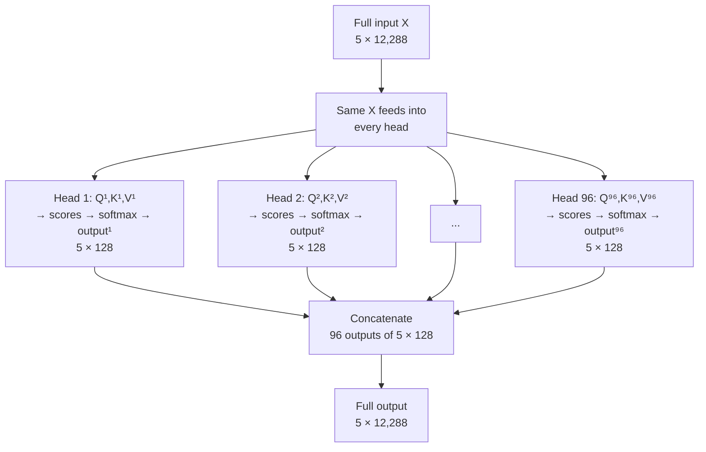

In our prompt "The cat sat on the," one head's specialization might be the *semantic* properties of each word — "cat" as an animal, "sat" as a physical action. That head would learn to attend based on meaning. Another head might specialize in *grammatical* roles — determiner, subject, verb, preposition. That head would learn the sentence's skeleton: which words depend on which, where the subject connects to the verb, where the preposition hooks into its object. A third head might specialize in *positional* features, learning to distinguish nearby tokens from distant ones. Each head learns a different lens on the same sentence and a different reason to pay attention.

As before, this is a pedagogical interpretation — in a trained model, we can't read a head's purpose from its weights. But the architecture is designed to encourage exactly this kind of specialization, and interpretability research has confirmed that it emerges in practice.

So why 96 smaller heads instead of one giant one? The answer comes down to how attention weights work. A single head produces one weight per pair of tokens — one number that has to encode *everything*: grammar, position, meaning, topic, co-reference. In our prompt, the last token "the" needs to attend to "cat" (it's the subject), to "sat" (it's the verb that determines what comes next), and to "on" (it sets up a spatial relationship). With one head, softmax forces a trade-off: if "cat" gets 0.55, "sat" must settle for 0.28 and "on" for 0.08. But these are different kinds of relevance — one is grammatical, one is semantic, one is positional. They shouldn't have to compete. With 96 heads, "the" can give "cat" 0.9 in one head (subject-verb agreement), "sat" 0.8 in another head (action → object prediction), and "on" 0.7 in a third (spatial relationship). No compromise. Each head learns its own reason to pay attention, and the results are combined afterward through concatenation.

The total capacity is preserved: 96 heads of 128 questions each is the same parameter count as one head of 12,288 questions. But independent attention patterns are far more expressive than a single merged one.

What about the other extreme — 12,288 heads of dimension 1? Too far. A single number per head carries too little signal for a meaningful dot product. The sweet spot balances richness per head with independence across heads.

96 isn't a magic number — it's a **hyperparameter** chosen through experimentation. The original transformer used 8 heads. GPT-2 used 12. Llama 2's 7B model uses 32. What matters is the concept: splitting attention into multiple independent heads.

All 96 heads together — the Q, K, V projections, the scaled dot-product, the softmax, the concatenation — constitute one **attention block**.

### What Attention Produces

Let's recap. We started with five isolated vectors — each token's embedding plus positional encoding. The attention block computed a **context delta (ΔX)** for every token — an adjustment informed by all the other words in the sentence. This delta gets added to the original input via the residual connection: the output is **X + ΔX**, not a replacement.

For our prompt, the token "the" at position 4 learned from "cat" that an animal is nearby, from "sat" that a sitting action occurred, and from "on" that a spatial relationship is in play. Its original vector X is preserved, and the context delta enriches it with all of that information. The same word "the" would produce a very different output in "the cat sat on the" versus "the car drove down the," because the surrounding words are different.

This enriched vector — X + ΔX, one per token — is what flows into the next stage: the feed-forward network.

---

## Step 5: Feed-Forward Network

*The FFN answers: "Given what I now know, what should I do with it?"*

So far, we've taken raw text, tokenized it, mapped tokens to embedding vectors, added positional encoding, and run everything through an attention block. The result: five context-enriched vectors. Now each of these vectors enters the second major component of the transformer layer — the **feed-forward network (FFN)**.

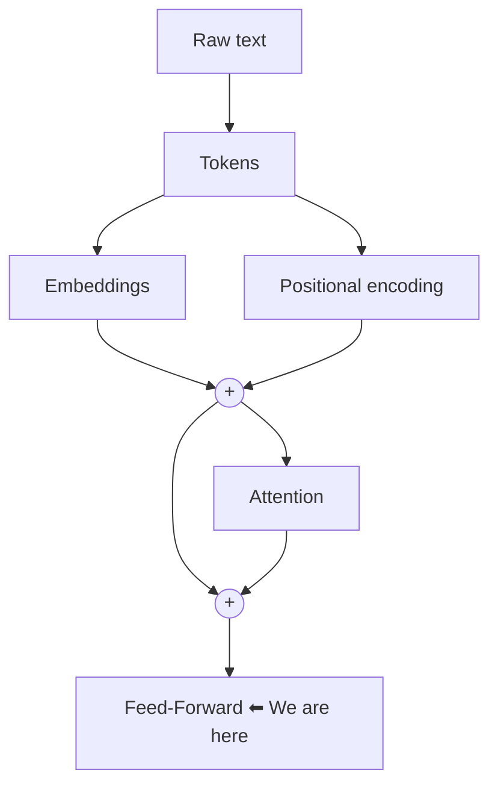

If attention is about tokens *gathering* context from each other, the FFN is about each token *processing* that context individually.

> As with attention, the vector passes through layer normalization before entering the FFN. Same purpose — keeping numbers stable across many layers. We'll cover this properly in the next section.

Why do we need this layer at all? Attention is powerful, but it has a fundamental limitation: it can only produce linear combinations of existing information. The attention output for a token is a weighted sum of other tokens' Value vectors — a blend of what's already there. If "the" attends to "cat" and "sat," it now carries a mixture of feline features and sitting-action features — but it can't yet recognize that "a small animal performing a sitting action on a surface" strongly suggests a word like "mat." That kind of pattern recognition requires applying learned knowledge on top of the blended vector.

That's what the FFN does. It encodes patterns learned during training. When the blended vector passes through, the FFN fires on recognized patterns: "furry + sitting + preposition → object is likely a surface." The output is a genuinely processed representation — not just a mix of what other tokens said, but a new vector that reflects what the model *knows* about the patterns it sees.

Each token's vector goes in alone, gets transformed, and comes out alone. No other tokens. No Query, Key, or Value. Just one vector in, one vector out.

Here's what happens inside, with dimensions at each step:

```
Attention output:     [1 × 12,288]    (one token's context-enriched vector)
           ↓
    X · W₁             W₁: [12,288 × 49,152]
           ↓
Intermediate:         [1 × 49,152]    (expanded to 4× the input)
           ↓
      ReLU             (positive stays, negative → 0)
           ↓
 Filtered:             [1 × 49,152]    (half the values zeroed out)
           ↓
    X · W₂             W₂: [49,152 × 12,288]
           ↓
   FFN output:         [1 × 12,288]    (same size as the input)
```

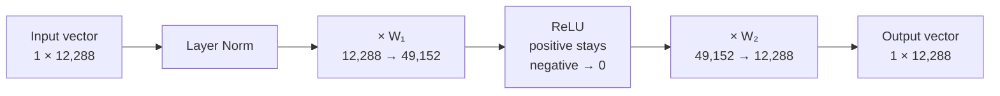

The key property: input and output have the same shape — 12,288 numbers. This is by design. The output is not a word prediction — it's still a 12,288-dimensional vector, just a processed version of the input. The actual prediction of the next token happens much later, after all processing is complete.

One more detail: the FFN output doesn't *replace* its input — it gets *added* to the vector that entered the FFN. That input is whatever came out of the attention block (already enriched with its own residual connection). We'll cover this full assembly when we look at the complete transformer layer next.

Inside, the vector temporarily balloons to 49,152 dimensions — four times the embedding size. This expansion gives the model room to apply its learned patterns. W₁ and W₂ contain everything the model learned from its training data: facts, language patterns, reasoning steps — all encoded as numbers. Like the attention matrices earlier, these aren't designed by hand. Every weight was learned during the training phase.

---

## Step 6: Transformer Layer

We now have the two main components: an attention block and a feed-forward block. One of each, wired together with residual connections and layer normalization, makes a **transformer layer** — the fundamental building block that gives the "T" in GPT its name.

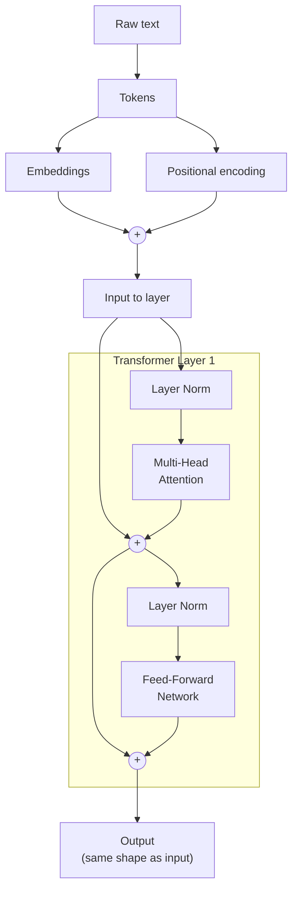

Let's trace it. The input X enters from the left. It first passes through **layer normalization** — its values get scaled so they have a mean of zero and a standard deviation of one. This keeps numbers stable across many layers. The normalized vector feeds into the attention block, which produces a context delta.

Now the residual connection: the attention output gets **added** to the original X (the arrow bypassing the attention block). X isn't discarded — it's preserved and updated. The same pattern repeats for the FFN: layer norm, then FFN, then addition with the vector that entered the FFN.

Two things hold this together. Residual connections preserve the original signal — the attention output and the FFN output are both *added* to what came before, not substituted. And layer normalization, applied before each block, keeps the numbers stable.

Together, these pieces — attention block, feed-forward block, residual connections, and layer normalization — form a single **transformer layer**, the fundamental building block that gives the "T" in GPT its name.

---

### A Note on Mixture of Experts (MoE)

Before we continue, a quick word on terminology. The architecture we've described so far — where every token passes through the same FFN — is called a **dense** transformer. Every parameter is activated on every token, every time.

There's a widely-used variant called **Mixture of Experts (MoE)** that's worth being aware of, even though we won't cover it in detail here. Many of today's models — including open-weight ones like Mixtral and DeepSeek — use MoE.

In an MoE layer, instead of one FFN, there are multiple smaller "expert" FFNs. A **router** — which is just another learned linear layer with its own weights, trained during the training phase — decides which expert(s) each token should be processed by. A token about "cat" might be routed to an expert specializing in animals; a token about "sat" to an expert handling verbs. Typically only 2 out of 8 or more experts are activated per token.

The advantage: the model has far more total parameters (and therefore more knowledge capacity), but only a fraction of them are activated during inference. You get more knowledge without proportionally more compute. The trade-off is added complexity — routing decisions, load balancing across experts, and training stability all become new challenges.

For the rest of this document, we'll stick with the dense architecture. The concepts we've built — tokenization, embeddings, attention, FFNs, and transformer layers — apply to both.

---

## Step 7: Stacking Layers

A single transformer layer is powerful, but the real magic comes from repetition. Take the output of layer 1 and feed it as the input to layer 2. Then layer 3. Then layer 4. Each layer has its own learned parameters — its own attention matrices, its own FFN weights — and each one builds on what the previous layer produced.

This is worth emphasizing: every weight matrix we've discussed — W_Q, W_K, W_V for every attention head, W₁ and W₂ in every FFN — exists independently in each layer. Layer 1's attention matrices are completely different numbers from layer 2's. Nothing is shared. When we say GPT-3 has 175 billion parameters, most of them come from this repetition: 96 copies of every matrix, each learned to do a slightly different job at its depth.

Why does stacking help? Think of it as progressive refinement. Early layers tend to learn surface-level patterns — syntax, local word relationships, basic grammar. Middle layers start tracking longer-range dependencies — which pronoun refers to which noun, what the paragraph is about. Later layers integrate everything into higher-level understanding — tone, intent, factual consistency. Each layer adds another round of attention (re-evaluating which tokens matter) and another round of FFN processing (applying learned patterns to the increasingly rich representation).

This works because every layer preserves the same dimension — 12,288 in, 12,288 out. The output of layer 1 is the same shape as its input, so layer 2 accepts it without any conversion. The residual connections ensure the original signal never gets lost, no matter how deep the stack goes.

How many layers? GPT-2 used 12. GPT-3 uses 96. The number 96 isn't sacred — it's a scaling choice, like the number of attention heads. You could build a model with 106 layers, or 200, if you had the compute to train it. There are diminishing returns — each additional layer adds less benefit than the previous one — but in practice, deeper models consistently perform better, all else being equal. The architecture barely changed between GPT-2 and GPT-3. They just stacked more of the same thing.

(And to avoid confusion: 96 layers has nothing to do with 96 attention heads. Layers are vertical — one after another. Heads are horizontal — running in parallel within each layer.)

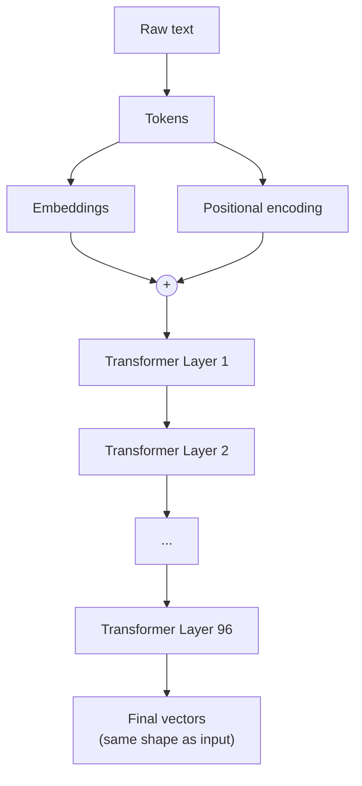

---

## Step 8: Unembedding + Softmax

After 96 layers, every token's journey is complete. What started as a simple integer has been transformed through embeddings, positional encoding, attention, and feed-forward processing — 96 times over — into a deeply context-aware representation. Each token's final vector is a 12,288-number summary of everything the model knows about that word *in this specific context*.

For our prompt "The cat sat on the," here's what each final vector represents:

- The vector for **"The"** (position 0) encodes that it's the start of a sentence about a cat doing something.
- The vector for **"cat"** (position 1) knows it's the subject of a sitting action, near a preposition, likely followed by a surface.
- The vector for **"sat"** (position 2) knows it's a verb, performed by a cat, with a location coming up.
- The vector for **"on"** (position 3) knows it's a preposition setting up a spatial relationship — whatever comes next is probably a physical object.
- The vector for **"the"** (position 4) has absorbed all of this: a cat sat on something. It's positioned to predict what that something is.

Four of these vectors get discarded. Only the last one — "the" at position 4 — is used for prediction. Why? Because the model's job at this moment is to predict token 6 (position 5). The last token is the only one that has seen all preceding context without a successor to predict from. The earlier tokens did their real work during attention, when they contributed their Keys and Values to help the last token figure out what's going on.

Now this single vector — 12,288 numbers — must be turned into an actual prediction. It gets multiplied by the **unembedding matrix**. This is the reverse of the embedding matrix we saw in Step 2:

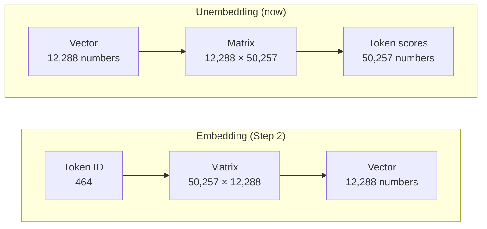

Embedding went from token ID → vector. Unembedding goes from vector → token scores. Two sides of the same coin.

```
Final vector:        [1 × 12,288]
Unembedding matrix:  [12,288 × 50,257]
                            ↓
Raw scores:          [1 × 50,257]    (one score per token in the vocabulary)
```

Each of these 50,257 numbers is a raw score for one possible token. But they're unconstrained — positive, negative, large, small. To turn them into probabilities, they pass through **softmax**.

Softmax takes a list of numbers and transforms them so that each one becomes a value between 0 and 1, and the whole list sums to exactly 1. Mathematically, for each score `sᵢ`:

```
softmax(sᵢ) = e^(sᵢ) / (e^(s₁) + e^(s₂) + ... + e^(s₅₀₂₅₇))
```

Each score gets exponentiated (which makes everything positive and amplifies differences — large scores become much larger relative to small ones), then divided by the sum of all exponentiated scores (which forces them to sum to 1). The result is a proper probability distribution.

This is the same softmax we've used throughout the attention sections — whenever you saw scores normalized into weights that sum to 1, softmax was doing the work.

A quick example. Take three raw scores: [2.1, 3.2, 0.5]. Softmax transforms them:

```
e^2.1 ≈ 8.17     →   8.17 / 35.81 ≈ 0.23   (23%)
e^3.2 ≈ 24.53    →  24.53 / 35.81 ≈ 0.69   (69%)
e^0.5 ≈ 1.65     →   1.65 / 35.81 ≈ 0.05   ( 5%)
               sum = 35.81             sum = 1.00
```

The highest score (3.2) gets the lion's share. The lowest (0.5) gets almost nothing. But every token gets a slice — no score is completely eliminated. That's softmax.

The model outputs a probability for every possible next token:
- "mat": 38%
- "is": 14%
- "was": 8%
- The other 50,254 tokens share the remaining 40%.

---

## Step 9: Sampling + Temperature

The model has produced a probability distribution over 50,257 tokens. You might think the obvious next step is to pick the highest-probability token and call it done. After all, the model went through 96 layers of careful computation — surely the top pick is the best one?

At each individual step, the top pick is usually reasonable. But language has many valid continuations — after "The cat sat on the," both "mat" and "floor" and "chair" are plausible. Greedy decoding always takes the single most likely one, which biases the output toward the most statistically common patterns in the training data. Over many steps, this compounds: the model drifts into repetitive, high-frequency loops because it never explores the slightly-less-likely path that would have led somewhere more natural.

Instead, we **sample**. We treat the probability distribution like a weighted lottery. "mat" has a 38% chance of being picked. "is" has 14%. Every token gets a shot proportional to its probability. Most of the time, a high-probability token wins — but occasionally, a 5% underdog gets chosen, and that small deviation can steer the entire generation away from a repetitive rut. This is why the same prompt can produce different responses.

There's a second reason sampling matters. The model's probability distribution is learned from training data — a finite sample of human language, not a perfect representation of it. The highest-probability token in the model's distribution isn't always the best token for your specific context. Sampling gives tokens that are slightly less likely (according to the training data) a real chance to be picked, which can produce output that's actually better suited to the prompt at hand.

And there's a knob that controls how creative this sampling is: **temperature**.

Temperature is applied before softmax. Instead of computing `softmax(scores)`, the model computes `softmax(scores / T)`, where T is the temperature. A smaller T makes the distribution sharper; a larger T makes it flatter.

Before softmax, we divide all raw scores by the temperature value. Temperature controls how much the model "trusts" its raw scores:

- **Low temperature (T = 0.2)**: Dividing by a tiny number stretches the gaps between scores. High scores become enormous relative to low ones. After softmax, "mat" might go from 38% to over 90%. The distribution is sharp and confident — the model sticks to what it knows best. Use this when you want factual, deterministic output: code generation, math, translation.

- **High temperature (T = 2.0)**: Dividing by a larger number shrinks the gaps. High and low scores get pulled closer together. After softmax, "mat" might drop to 15%, and unlikely tokens suddenly have a real shot. The distribution flattens — the model explores more. Use this for creative writing, brainstorming, or when you want variety. But push it too high and the output becomes incoherent.

- **T = 1.0**: Raw distribution, no modification. The model's learned probabilities as-is.

Then the chosen token gets appended to the input — and the entire pipeline runs again.

---

## The Full Pipeline, End to End

```
Input Text
    ↓
Tokenizer → Token IDs
    ↓
Embedding → Vectors
    ↓
Positional Encoding → Vectors with position
    ↓
┌─────────────────────────────────┐
│  Layer 1                        │
│   Multi-Head Attention (+Res)   │  ← Add residual connection
│   Layer Norm                    │
│   Feed-Forward (+Res)           │  ← Add residual connection
│   Layer Norm                    │
├─────────────────────────────────┤
│  Layer 2 … (same structure)     │
├─────────────────────────────────┤
│  …                               │
├─────────────────────────────────┤
│  Layer 96                       │
│   Multi-Head Attention (+Res)   │
│   Layer Norm                    │
│   Feed-Forward (+Res)           │
│   Layer Norm                    │
└─────────────────────────────────┘
    ↓
Unembedding Matrix → 50,257 scores
    ↓
Softmax → Probability distribution
    ↓
Sample (with Temperature) → Next token
    ↓
Append to input → Repeat
```

This entire pipeline runs once per token. A hundred-token response is a hundred complete passes through a 96-layer network.

---

## Training: How It Learned All of This

We've spent this entire document on inference — what happens when you give a trained model a prompt. But how did all those weight matrices get their numbers? Training is a massive topic in its own right, and we won't cover it in depth here. But here's the short version.

Training is its own separate phase — distinct from everything we've described so far. Think about everything that needs to be learned: the token embeddings, every Q, K, V matrix across 96 layers, every W₁ and W₂, the unembedding matrix. In GPT-3, that's **175 billion numbers** — and initially, they're all random. The model knows nothing.

Training is simple in concept: show the model trillions of text examples. Each time, it predicts the next token. When it's wrong — and early on, it's always wrong — a technique called **backpropagation** nudges every weight in the direction that would have made it more right. Trillions of tiny nudges, across thousands of GPUs, over months.

And at the end of it all, the model has internalized patterns of language so deeply that it rarely misses.

---

## Emergence

An LLM is a machine that predicts the next token. That's it. That's all it was trained to do. "The cat sat on the" — what comes next? "Mat."

Now imagine I showed you this architecture — 96 layers of attention and feed-forward, 175 billion parameters, trained on next-token prediction — and asked you: what can this thing do? You'd probably guess: complete sentences. Stay on topic. Get basic grammar right. Those are the obvious consequences of next-token prediction.

But here's what actually happens:

- Ask it to translate English to French — it does it.
- Ask it to write a Python function that sorts a list — it does it.
- Ask it to solve a math problem, step by step, showing its work — it does it.
- Ask it to write a poem in the style of Shakespeare — it does it.
- Ask it to reason about what another person believes — it does it.

Nobody ever told this model what translation is. Nobody gave it a French textbook. Nobody taught it Python syntax. Nobody explained the rules of logic. Nobody programmed a theory of mind module.

In traditional software, every capability has to be explicitly added. Want spell check? Write a spell checker. Want language translation? Write a translation engine. But here — not a single one of these abilities was designed.

All of it emerged. From the simple act of predicting the next token — at massive scale — capabilities that look indistinguishable from understanding simply appear.

This is emergence. And it's the reason a machine trained to do nothing more than complete sentences is now writing code, translating languages, and passing exams. Not because anyone programmed it to. Because at sufficient scale, the simple act of prediction becomes something much, much more.

---

## Summary

Strip away the scale, and that's all an LLM is: a function that takes text and returns a probability distribution over the next token. That's it.

```
input text → f(x) → next-token probability distribution
```

We started with "The cat sat on the." We followed those five tokens through tokenization, embeddings, positional encoding, 96 layers of attention and feed-forward, through an unembedding matrix and softmax — all to produce 50,257 probabilities for what comes next. "Mat" got the highest score. The model sampled it. The loop continued.

---

## Key Constants (GPT-3 Reference)

| Constant | Value |
|---|---|
| Vocabulary size | 50,257 |
| Embedding dimension (d_model) | 12,288 |
| Attention heads | 96 |
| Head dimension (d_k) | 128 |
| Transformer layers | 96 |
| FFN intermediate dim | 49,152 |
| Total parameters | 175B |
